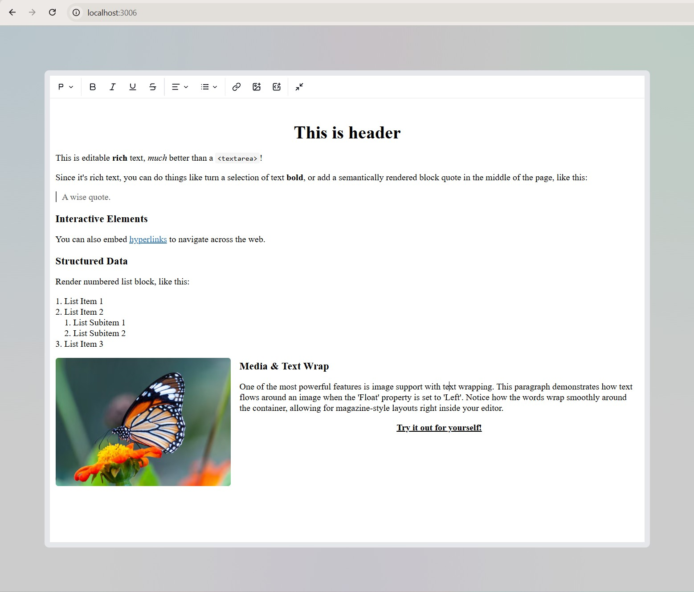

# React Slate Editor Playground

A modern, high-performance rich text editor built with **React 19**, **Slate.js**, and **Tailwind CSS v4**. This playground demonstrates advanced editor capabilities including complex block types, media embeds, and a seamless UI powered by **shadcn/ui**.



## ✨ Features

-   **Rich Text Formatting**: Bold, Italic, Underline, Code, and more.
-   **Block Types**: 
    -   Multiple Heading levels (H1-H6).
    -   Semantic Blockquotes.
    -   Bulleted and Numbered Lists.
-   **Advanced Media Support**:
    -   **Images**: Customizable width, alt text, and float alignment (Left, Right, Center).
    -   **Embeds**: Responsive YouTube/Vimeo integration with aspect-ratio support.
-   **Modern UI/UX**:
    -   Interactive toolbars and popovers.
    -   Global Dialog/Modal system powered by **Zustand**.
    -   Responsive design using **Tailwind CSS v4**.
-   **IFrame Sandbox**: The editor can be rendered inside a sandboxed IFrame for isolated styling and improved performance.

## 🛠️ Tech Stack

-   **Framework**: [React 19](https://react.dev)
-   **Editor Core**: [Slate.js](https://docs.slatejs.org)
-   **Styling**: [Tailwind CSS v4](https://tailwindcss.com)
-   **UI Components**: [shadcn/ui](https://ui.shadcn.com) (Radix UI)
-   **State Management**: [Zustand](https://zustand-demo.pmnd.rs) with [Immer](https://immerjs.github.io)
-   **Build Tool**: [Vite 7](https://vitejs.dev)

## 🚀 Getting Started

### Installation

1.  Clone the repository:
    ```bash
    git clone https://github.com/yalogica/react-slate-editor-playground.git
    cd react-slate-editor-playground
    ```

2.  Install dependencies:
    ```bash
    pnpm install
    ```

3.  Start the development server:
    ```bash
    pnpm dev
    ```

## 🔧 Configuration

The project uses a CSS-first approach for **Tailwind CSS v4**. Theme customizations can be found in `src/index.css` using the `@theme` directive.

## 📄 License

This project is licensed under the MIT License - see the [LICENSE](LICENSE) file for details.

---
Developed with ❤️ by [Max](https://x.com/mxlawr)